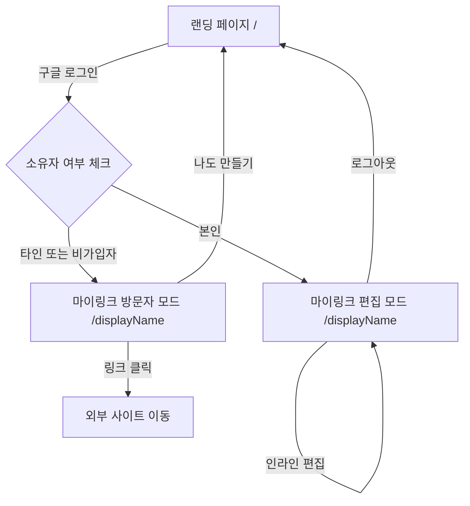
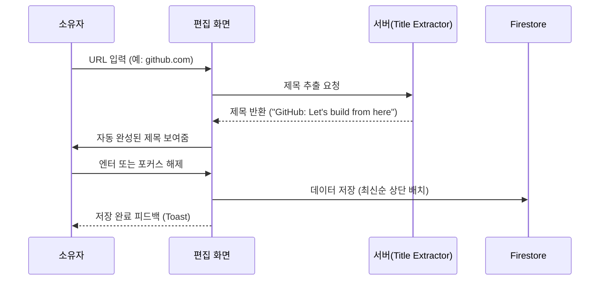

# 마이링크 (MyLink) - UI 구조 정의서

본 문서는 마이링크 서비스의 화면 구조와 컴포넌트 구성을 시각적으로 정의합니다. **shadcn/ui**의 디자인 철학인 미니멀리즘과 여백의 미를 반영하며, 모바일 우선(Mobile-First) 레이아웃을 지향합니다.

---

## 1. 서비스 전체 흐름 (Flow)



---

## 2. 메인 랜딩 페이지 (Landing Page)

사용자가 서비스에 처음 접속했을 때 마주하는 화면입니다. 압도적인 심플함을 유지합니다.

### 2.1 ASCII 구조 (Mobile View)
```text
+----------------------------+
|                            |
|                            |
|         마이링크           |
|                            |
|                            |
|       3초 만에 만드는      |
|       내 링크 명함         |
|                            |
|                            |
|     [ G 구글로 시작하기 ]  |
|                            |
|                            |
|                            |
+----------------------------+
```

---

## 3. 마이링크 프로필 페이지 (Bio Page)

실제 사용자의 링크들이 나열되는 핵심 페이지입니다.

### 3.1 소유자 편집 모드 레이아웃 (Owner/Edit Mode)
소유자가 로그인했을 때의 화면으로, 툴팁과 인라인 편집 UI가 활성화됩니다.

```text
+----------------------------+
| [복사하기]        [로그아웃] |
+----------------------------+
|                            |
|          (Profile)         |
|                            |
|        [username] <--- (1) |
|        [ bio... ] <--- (2) |
|                            |
+----------------------------+
|                            |
|  +----------------------+  |
|  | [f]  [Link Title]    |  |
|  |      [Link URL  ]    |  |
|  +----------------------+  |
|                            |
|  +----------------------+  |
|  | [+]  새 링크 추가     |  | <--- (3)
|  +----------------------+  |
|                            |
|      (나도 만들기 버튼)      |
+----------------------------+

(1) username: 클릭 시 인라인 편집 (툴팁: "이름을 수정하려면 클릭하세요")
(2) bio: 클릭 시 인라인 편집
(3) 새 링크 추가: URL 입력 시 제목 자동 추출 로직 작동
```

### 3.2 방문자 모드 레이아웃 (Visitor Mode)
일반 방문자가 보는 깔끔한 최종 결과물입니다.

```text
+----------------------------+
|                            |
|                            |
|          (Profile)         |
|                            |
|          username          |
|            bio             |
|                            |
+----------------------------+
|                            |
|  +----------------------+  |
|  | [f]  Link Title 1    |  |
|  +----------------------+  |
|                            |
|  +----------------------+  |
|  | [f]  Link Title 2    |  |
|  +----------------------+  |
|                            |
|                            |
|      [ 나도 만들기 ]        |
|                            |
+----------------------------+
```

---

## 4. 컴포넌트 상세 정의 (shadcn/ui 기반)

### 4.1 링크 카드 (Link Card)
- **컴포넌트**: `Card`
- **구성**:
  - `Avatar` (왼쪽): Google S2 API 기반 파비콘
  - `Content` (중앙): 타이틀 및 URL (소유자 모드에서는 인라인 수정 가능)
  - `Badge/Text` (오른쪽): 클릭 횟수(Clicks) 표시 (소유자에게만 노출)

### 4.2 인라인 편집기 (Inline Editor)
- 별도의 저장 버튼 없이, 포커스를 잃거나(onBlur) 엔터를 칠 때 자동으로 저장되는 `Input` 필드 방식.

### 4.3 토스트 알림 (Toast)
- **복사 성공 시**: shadcn/ui의 `Toast` 컴포넌트 출력.
```text
+----------------------------+
|                            |
|     ( i ) 링크가 복사됨    |
|     주소가 클립보드에...   |
+----------------------------+
```

### 4.4 툴팁 가이드 (Tooltip)
- 소유자가 최초 진입 시, 편집 가능한 영역 주변에 `Tooltip`을 노출하여 사용법 안내.

---

## 5. UI 시퀀스 다이어그램 (링크 추가 흐름)


